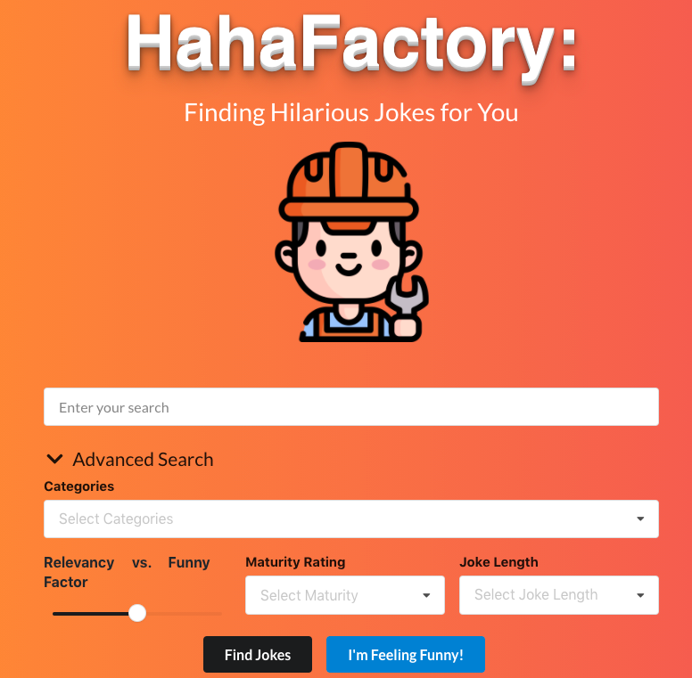

HahaFactory is a search tool that finds jokes based on an input of key words, categories, length, and other parameters. It queries a collection of 6000+ jokes scraped from various online sources, and utilizes several information retrieval techniques to determine the best matching jokes.

[Try it out](http://hahafactory-vf.herokuapp.com/) (You may need to refresh if it doesn't load)

Authors: Rachel Han, Winice Hui, Jason Jung, Suin Jung, Cathy Xin
